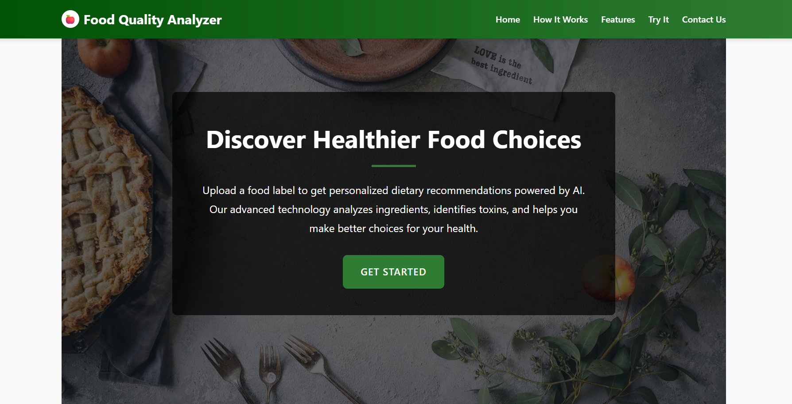
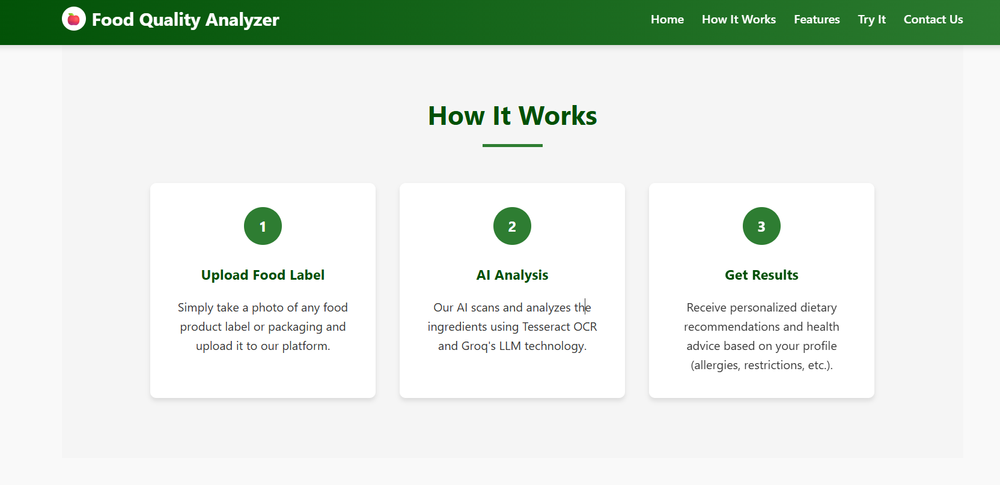
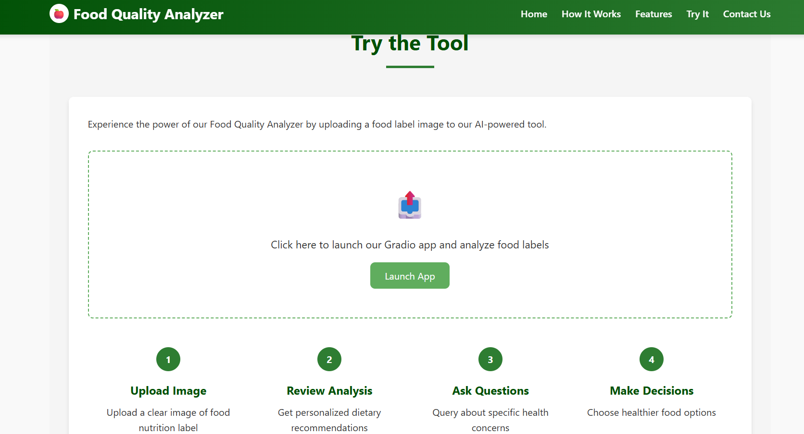
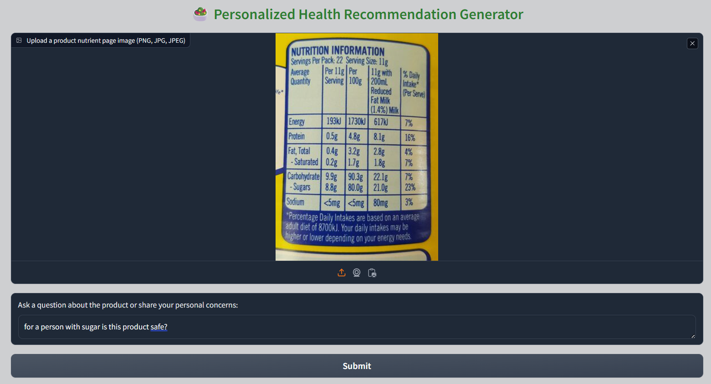
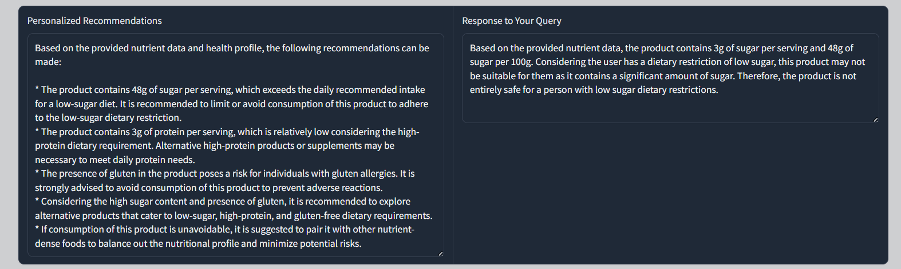

##Food Quality Analyzer

🍎 Overview
Food Quality Analyzer is an AI-powered web application that helps users make healthier food choices by analyzing food labels. By leveraging OCR technology and Large Language Models, the application extracts ingredient information from uploaded food label images and provides personalized dietary recommendations.

✨ Features

• Ingredient Analysis: Extract and analyze ingredients from food label images
• Allergy Detection: Identify potential allergens based on personal health profiles
• Personalized Recommendations: Get custom advice based on dietary restrictions
• Interactive Q&A: Ask specific questions about products and receive AI-powered responses

🛠️ Technologies Used

• Frontend: HTML, CSS, JavaScript
• Backend: Python with Gradio
• OCR Engine: Tesseract OCR for text extraction from images
• LLM: Groq for natural language processing and analysis
• ChatGroq: For generating personalized health recommendations.
• Deployment: Web interface with integrated Gradio application

📊 Problem & Solution
The Problem
Many consumers struggle to make informed decisions about food products due to:

• Complex ingredient lists that are difficult to understand
• Hidden additives and preservatives with potential health impacts
• Challenges identifying allergens or problematic ingredients
• Time constraints when shopping that limit research opportunities

Our Solution
Food Quality Analyzer bridges this knowledge gap by:

1. Instantly analyzing food labels with advanced AI technology
2. Providing clear, personalized recommendations based on individual health profiles
3. Highlighting potentially harmful ingredients and suitable alternatives
4. Making nutritional information accessible and actionable

🚀 Getting Started
Prerequisites

• Python 3.8+
• Tesseract OCR installed
• Groq API key

📸 Screenshots

🌟 Benefits

• Health Awareness: Better understanding of what's in your food
• Time Saving: Quick analysis instead of manual research
• Personalized Health: Recommendations tailored to individual needs
• Educational: Learn about ingredients and their potential health impacts
• Accessibility: Make informed choices without needing specialized knowledge

📂 Repository Structure

food-quality-analyzer/
├── app.py               # Gradio application entry point
├── index.html           # Main website landing page
├── utils.py             # Utility functions for OCR and analysis
├── test_groq.py         # Test script for Groq API integration
├── requirements.txt     # Python dependencies
├── .env                 # Environment variables (not included in repo)
├── .gitignore           # Git ignore file
└── README.md            # Project documentation

📝 License
This project is licensed under the MIT License - see the LICENSE file for details.

  Made with ❤️ for healthier food choices

